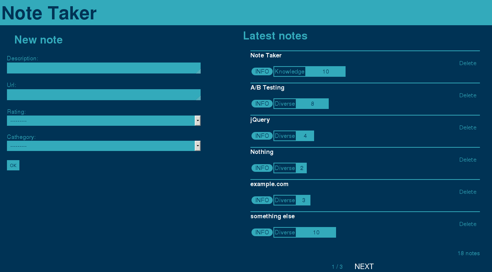

# Simple Django Bookmarks App

This is a simple Django bookmarks example app.

## Features

- bookmark creating + deleting

  Each bookmark has
  + a description
  + a URL
  + a rating (0-10)
  + a cathegory (predefined)

- an overview page for each bookmark
- an overview page for each cathegory (not paginaized!)
- an overview page for each rating (not paginaized!)
- a list of all bookmarks
- Everything is blue!

## Usage

Run this:

    python manage.py runserver 4321

Make your browser take you to:

    http://localhost:4321/notes
